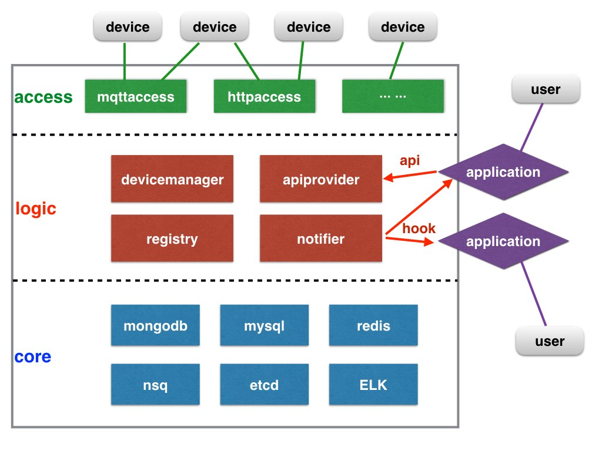

# pando-cloud     

PandoCloud是Pando物联网解决方案的一部分。

## 什么是Pando？

Pando是一套完全开源的物联网解决方案。致力于帮助开发者快速创建自己的物联网应用。它包含了如下的工具，协议和类库：

* Pando Cloud
* [Pando Embeded Framework](https://github.com/PandoCloud/pando-embeded-framework)
* [Pando Protocol](https://github.com/PandoCloud/pando-protocol)
* Mobile SDK for [Android](https://github.com/PandoCloud/pando-android-sdk) and [IOS](https://github.com/PandoCloud/pando-ios-sdk)
* IoT Explorer APP FreeIOT for [Android](https://github.com/PandoCloud/freeiot-android) and [IOS](https://github.com/PandoCloud/freeiot-ios)
* IoT Kit [Tisan](https://github.com/tisan-kit)

## 设计理念

Pando的目的是为了提供一套可应用于实际生产环境的的物联网解决方案。它并不是一个简单的用于演示物联网服务的测试demo。下面列举了实现这套方案我们需要思考的一些关键点：

* **IoT**: 应该提供一套物联网应用场景的最佳实践。
* **stability**: 应该被充分的测试，并少有缺陷。
* **distributive**: 可以方便的部署在单机和集群环境中。
* **availability**: 提供容错能力，灾备能力，自我修复机制等。
* **extensibility**: 必须是模块化，可插拔。
* **accessibility**: 易于学习的开发和部署方式。
* **universality**: 通用的设计和深度的性能优化。
* **efficiency**: 在硬件能耗和网络带宽使用上要尽量降低。
* **security**: 避免降低入侵和破解的风险。
* **scalability**: 轻松管理数千乃至数亿级的物联网设备。

## 框架概述

框架采用三层架构。

### 接入层
接入层提供使用不同的协议的设备的通信连接，包括但不局限限于HTTP协议，XMPP协议，MQTT协议，COAP协议。 设备注册，身份验证和设备发现使用HTTP协议。目前，我们使用MQTT协议与设备进行通信。
### 逻辑业务层
逻辑业务层用于实现整个物联网面相设备的相关业务，例如设备管理和API等。
* **registry**: 负责维护平台级的配置信息和元数据。
* **devicemanger**: 设备管理器用于管理设备和处理设备的数据请求，并保持、监视设备状态。
* **apiprovider**: 为应用程序扩展提供Restful API。
* **notifier**: 用通知形式告诉应用程序现在设备的状态变化。

### 核心层 

我们的核心服务所选择的开源程序：

* **mongodb**: 用mongodb做为设备的数据存储引擎。
* **mysql**: 用MySql存储同类型设备的全局配置信息。
* **redis**: 使用redis提供缓存服务。
* **nsq**: 异步通信消息队列做为消息通知中心。
* **etcd**: 高可用的键值存储系统,主要用于共享配置和服务发现。
* **ELK**: elk日志分析系统即Logstash+ElasticSearch+Kibana4的组合简称，主要用于日志记录和分析。

## 技术参考

* [micro-services](http://martinfowler.com/articles/microservices.html)
* [12-factor apps](http://12factor.net/)
* [GoLang](http://golang.org)
* [MQTT](http://mqtt.org/)
* [Docker](http://www.docker.com/)
* [MySQL](http://www.mysql.com/)
* [MongoDB](https://www.mongodb.org/)
* [redis](http://redis.io/)
* [etcd](https://github.com/coreos/etcd)
* [nsq](http://nsq.io/)
* [ELK](https://www.elastic.co/products)